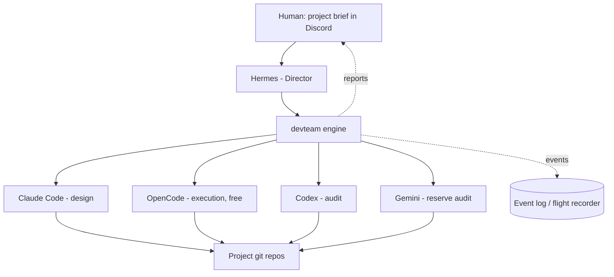
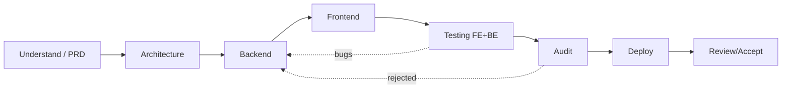

# DEV-TEAM — Overview (for collaborators)

> An autonomous, multi-agent software development organization. You describe a
> project; a director agent (Hermes) breaks it down and a team of AI "brains"
> (Claude Code, Codex, OpenCode, Gemini) design, build, test, audit and deploy
> it — under a deterministic engine that enforces process, quality, budget and
> memory. Built by MG Solutions.

## The thesis

**The director sustains the system, but the software is built by the COLLECTIVE.**
No single model does the work; the result comes from coupling five things:

1. **Hermes** — the director (high-level judgement and orchestration).
2. **The engine (`devteam`)** — deterministic Python that enforces what must
   not fail: state, budget, quality, isolation, memory.
3. **The brains** — the LLMs that design and write (via their headless CLIs).
4. **The memory** — what makes stateless agents behave like one coherent team.
5. **The skills & rules** — the shared craft that makes output consistent.

Remove any one and the rest is not enough. This is a **system**, not an agent.

## What it does (the loop)

## The pipeline (every project)

Rules that govern it: strict-sequential phases, one project at a time, quality
over speed (nothing advances without gates + audit), agents fix their own
failures first (a 3-attempt self-correction cascade), and only unrecoverable
problems escalate to the human. Human checkpoints after PRD and Architecture,
and a final acceptance gate.

## How advanced is it? (honest assessment, 2026-06)

| Area | Status | % |
|---|---|---|
| Engine core (state, budget, router, executor, memory, gates, audit, scorecard, daemon, listener, doctor, catalog, eventlog, presets) | Built, ~140 tests green | **~85%** |
| Brains connected (Claude/Codex/OpenCode/Gemini + jcode optional) | 4 default wired + jcode (off-route, to benchmark); Gemini disabled by choice | **100%** |
| Memory & learning loop (per-project + reflective + lessons + catalog) | Built | **~80%** |
| Pipeline end-to-end on a REAL project | **Design half validated on a real project** (estreno 2026-06-18: pm→PRD and architect→architecture/contracts/data-model, with human checkpoints); a critical brain-write bug was found + fixed. Code/QA/deploy phases E2E still pending. | **~40%** |
| Autonomous deploy | Artifacts generated; real deploy blocked by current infra | **~30%** |
| Grand vision ("Dev OS": many products in parallel, 24/7 autonomous) | Foundations only | **~20%** |

**The biggest gap is real-world validation**, not code: the machinery exists and
is tested, but it has not yet taken one real project from brief to delivery. That
first end-to-end run is where the next real learnings come from.

## The goal (where we are going)

A **Development Operating System**: a partner describes what they want, and the
system delivers production software — designed, built, tested, audited, deployed,
documented — at the quality and consistency a customer pays for, running
continuously, getting better with every project (reusable component catalog +
reflective learning). The orchestrator is an **internal tool for MG + IDA** — it
is not sold to clients. What we sell is the **software the team builds**, not the
system itself (see `04-COLLABORATION.md` and `03-ROADMAP.md`).

## Read next
- `01-ARCHITECTURE.md` — how it's programmed, module by module, with diagrams.
- `02-EXTENDING.md` — how to add skills, roles, agent presets and MCPs.
- `03-ROADMAP.md` — the complex features to build (the "monster" plan).
- `04-COLLABORATION.md` — how we work together (repos, language, workflow).
