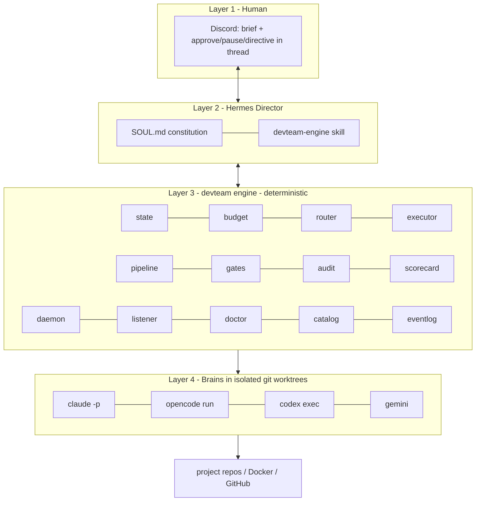

# Architecture — how it's programmed

> Python 3.11, no framework, ~30 modules in `devteam/`. Philosophy: **the AI
> decides CONTENT; the engine enforces PROCESS.** Anything that must not fail
> (state, money, quality, isolation) is deterministic, tested code — not a
> model's judgement.

## Layers

## Module map

### Core (the unbreakable "what")
- `config.py` — paths, the state machine (`STATES`, `TRANSITIONS`,
  `HUMAN_CHECKPOINTS`), model catalog + pricing, `resolve_cli()` (finds CLI
  executables on Windows).
- `state.py` — `Project`: per-project state machine, persisted to
  `<project>/.project-memory/project.json`. Validated transitions
  (`new→clarification→pm→architect→backend→frontend→qa→deploy→review→done`,
  plus a `paused` flag). Also the project `registry`.
- `budget.py` — the brake. `charge()` raises `BudgetExceeded` at the cap; alert
  at 80%. Cost estimated from the price table.
- `subscription.py` — ration guardian for the premium brains (daily call
  budgets; rate-limit detection → "resting"). Protects the humans' interactive
  use of the same subscriptions.
- `instruction.py` — builds the **5-block instruction** every agent receives
  (ORIENTATION → TASK → CONSTRAINTS → ROLE KNOWLEDGE → CLOSE-OUT). `build()`
  raises if any block is missing → a malformed instruction is impossible
  (ADR-015 memory-handoff protocol).
- `router.py` — picks the brain per task: design→claude, execution→opencode
  (free→cheap), audit→a brain different from the author, critical→premium; if
  all premium brains are resting, it DEFERS (does not silently degrade).

### Arms (the "how" it executes)
- `brains/` — one invoker per brain (`claude.py`, `codex.py`, `opencode.py`,
  `gemini.py`) over a common `BrainResult`. Headless CLI, prompt via STDIN
  (npm `.cmd` wrappers mangle multiline args), with timeout, normalized output
  + cost estimate. `opencode.invoke_with_fallback` rotates models on rate limits.
- `worktree.py` — each task runs in an isolated git worktree (own branch). All
  git calls have timeouts.
- `memory.py` — the relay protocol: read/write STATE.md & NOTES.md and VERIFY
  the agent updated memory (if not, the task does not count).
- `skillpack.py` — loads each role's skill pack (senior craft) and injects it
  as the 4th instruction block. Includes the learning loop (`<role>-lessons.md`)
  and per-project-type skills (web/api/mobile).
- `executor.py` — **the spine.** `execute_task()` is the ONLY path by which a
  brain touches a project (route → worktree → 5-block instruction → invoke →
  ration → verify handoff → charge budget → commit signed by model → scorecard
  → event log).

### Orchestration (the "when" + quality)
- `roles.py` — the prompt for each phase (PM/Architect/Backend/Frontend/QA/
  Review/Deploy): what it asks, acceptance criteria, criticality.
- `standards.py` — `STANDARDS.md`: the single way the team builds (structure,
  code rules, security, tests). This is what makes 10 projects look like one team.
- `pipeline.py` — `run_phase()`: runs the current phase with the
  self-correction cascade (3 attempts with feedback), applies gates and audit,
  merges, handles human checkpoints.
- `gates.py` — quality gates: lint + build + tests + a built-in **secret scan**
  (always). Nothing merges without passing.
- `audit.py` — multi-model audit panel (1 auditor / 3+consensus by criticality),
  with a brain different from the author.
- `reflective.py` — the **scorecard**: records which model did what and how it
  went; auto-benches sustained failures (premium brains protected).
- `daemon.py` — the 24/7 loop: applies Discord interventions, picks the next
  actionable project, runs one phase, reports. Single-instance pidfile lock;
  any unexpected exception PAUSES the project and notifies (never silent
  re-fail loop). Survives restarts (all state on disk).

### Interface & ops
- `discord_listener.py` — reads the project thread (REST, Hermes bot token) and
  applies `approve/pause/resume/directive` — only from allow-listed authors.
- `discord_bridge.py` — reports via `hermes send` (secrets redacted on egress).
- `intake.py` / `adopt.py` — new project from a brief / adopt an existing repo
  (without touching its code).
- `doctor.py` — checks all system connections without spending tokens.
- `catalog.py` — the reusable-component catalog (SAA / ADR-010): search /
  register / mark-used; the Architect consults it before designing.
- `eventlog.py` — append-only JSONL flight recorder, secret-redacted.
- `presets.py` — ready-made agent configs (role+brain+model+skills+MCPs).
- `cli.py` — the command surface (`devteam ...`) used by Hermes and humans.
- `storage.py` — atomic JSON writes + safe loads + secret redaction (shared).

## The life of one task (exact path through the code)

`executor.execute_task()`, in order:
1. **Route** (`router.route`) — which brain (role, criticality, budget, rations).
   If all premium rest → returns "defer".
2. **Worktree** (`worktree.create`) — isolated branch+folder.
3. **Snapshot memory** (`memory.snapshot_memory`) BEFORE invoking.
4. **5-block instruction** (`instruction.build` + `skillpack.load_for_role`).
5. **Invoke** (`brains.get_invoker`) — headless CLI in the worktree.
6. **Ration** (`subscription.record_call`) — count premium calls; rate limit → rest+defer.
7. **Verify handoff** (`memory.verify_handoff`) — did the agent update memory?
   If not, one retry with explicit warning; still not → `handoff_violated`.
8. **Charge** (`budget.charge`) — record spend; 80% alert, 100% pause.
9. **Commit** (`worktree.commit_all`) — signed with `Model:`/`Role:` trailers.
10. **Scorecard + event log** — accountability.

## State files (the glue)
Everything durable is a versioned/persisted file, which makes the system
inspectable, reproducible and crash-resistant:
- `<project>/.project-memory/` — `project.json` (state), `STATE.md` (done/pending),
  `NOTES.md` (decisions, handoffs).
- `data/` (engine state, gitignored) — `registry.json`, `scorecard.json`,
  `subscription.json`, `events.jsonl`, `catalog.json`, `listener-cursors.json`,
  `daemon.pid`.
